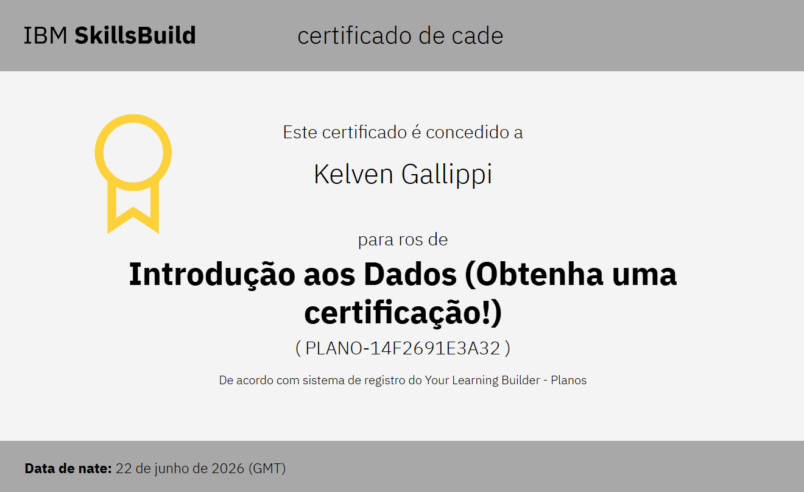
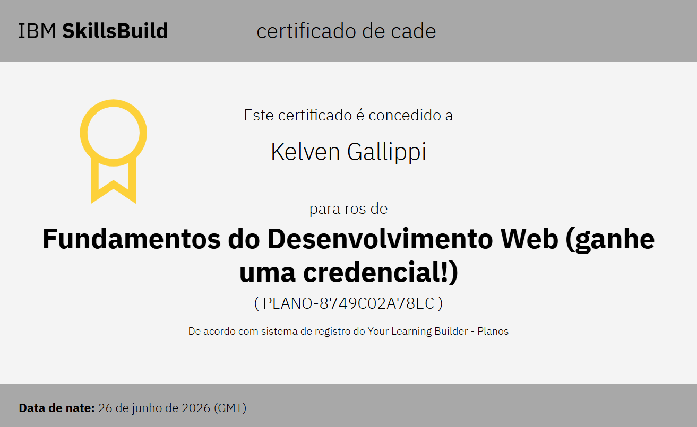
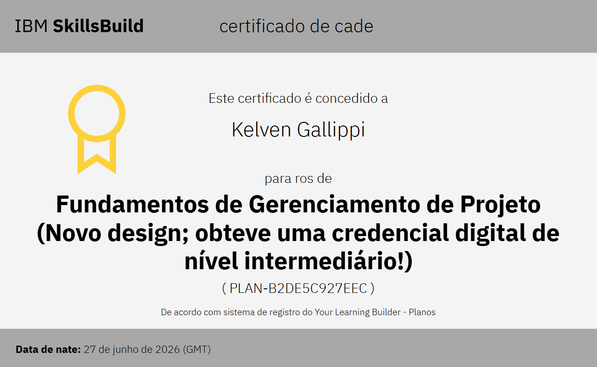

<p align="center">
  
</p>

<h1 align="center">
  Me chamo Kelven Gallippi!
</h1>

<p align="center">
<a href="https://github.com/Kelven7595">
  
</a>
</p>

---

<h1 align="center">Certificados</h1>

<div align="center">

<a href="https://skills.yourlearning.ibm.com/certificate/share/dfdd125386ewogICJsZWFybmVyQ05VTSIgOiAiODA3MTcwNVJFRyIsCiAgIm9iamVjdFR5cGUiIDogIkFDVElWSVRZIiwKICAib2JqZWN0SWQiIDogIlBMQU4tMTRGMjY5MUUzQTMyIgp9c4ebe69ddc-10">
    
</a>

<a href="https://skills.yourlearning.ibm.com/certificate/share/a4a62e0b26ewogICJvYmplY3RJZCIgOiAiUExBTi0xNEYyNjkxRTNBMzIiLAogICJsZWFybmVyQ05VTSIgOiAiNzk3OTI5OFJFRyIsCiAgIm9iamVjdFR5cGUiIDogIkFDVElWSVRZIgp9ccb6d2e563-10">
    
</a>

<a href="#">
    
</a>

<a href="https://skills.yourlearning.ibm.com/certificate/share/ef430ea32bewogICJvYmplY3RUeXBlIiA6ICJBQ1RJVklUWSIsCiAgImxlYXJuZXJDTlVNIiA6ICI3OTc5Mjk4UkVHIiwKICAib2JqZWN0SWQiIDogIlBMQU4tQjJERTVDOTI3RUVDIgp9b3be0777f1-10">
    
</a>
</div>

<h2> 👨🏻‍💻 Um pouco sobre mim</h2>

```yaml
nome: Kelven Chetz Man Gallippi
localização: Varzea Paulista, São Paulo
idade: 01/03/2011

estudando:
  - Projeto de Tecnologia
  - Programação
  - Desenvolvimento Web
  - Banco de Dados
  - Arte Digital

áreas_de_interesse:
  - Front-End
  - Avanço Técnologico
  - Inteligência Artificial (ChatGPT / Gemmini )
  - Jogos

aprendendo_atualmente:
  - HTML
  - CSS

hobbies:
  - Jogos Eletrônicos
  - Esportes
```

---

<h2> 🚀 Tecnologias e ferramentas</h2>

<p align="left">


</p>

<p align="center">
  
</p>

---
